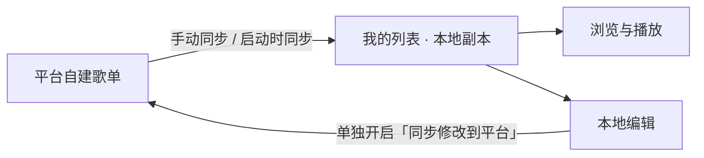

<p align="center"></p>

<h1 align="center">LX-M Music 桌面版</h1>

<p align="center">多平台音乐搜索 · 本地歌单管理 · 桌面歌词 · 可选音效与可视化</p>

<p align="center">
  <a href="https://github.com/Miao-moe/lx-m_lx-Miao-moe-music-desktop/releases">下载发布版本</a> ·
  <a href="https://github.com/Miao-moe/lx-m_lx-Miao-moe-music-desktop/issues">问题反馈</a> ·
  官方 QQ 群：<strong>1083366464</strong>
</p>

[功能与使用](#功能与使用) · [开发与构建](#开发与构建) · [代码入口](#代码入口) · [常见问题](./FAQ.md) · [致谢与协议](#致谢与协议)

## 功能与使用

### 搜索、歌单与歌手详情

**支持平台：** 酷我 · 酷狗 · QQ 音乐 · 网易云 · 咪咕

| 想做什么 | 操作与功能 |
| --- | --- |
| 查找音乐 | 搜索歌曲、歌单、歌手或专辑，具体类型以平台支持为准 |
| 了解歌手与专辑 | 点击列表中的歌手或专辑信息，进入独立详情页 |
| 浏览与收藏 | 在线歌单、排行榜、推荐歌单、我的列表、播放队列 |
| 调整封面 | 设置 → 列表设置；歌曲列表与下载列表支持 **20–100 px** 封面 |
| 操作歌曲 | 右键歌名或歌曲行打开菜单，可进行歌曲换源等操作 |
| 切换平台名称 | 按设置显示平台原名或别名 |
| 重试加载 | 部分列表提供重试入口；页面异常时可通过错误页重试或切页恢复 |

**歌曲换源：** 默认按歌名、歌手和时长筛选匹配版本，并优先打开有匹配歌曲的平台；找不到时可取消“仅显示匹配版本”查看其他搜索结果。点击试听会直接播放并选中该候选，切换平台会清空旧选择。确认后在原位置替换歌曲，保存失败保留原曲。

> 歌手头像、简介等信息由平台提供；缺失时显示占位内容。

### 歌单和封面缓存

| 功能 | 使用体验 |
| --- | --- |
| 本地歌单 | 歌曲数据保存在本地；增删歌曲、调整顺序会同步保存 |
| 列表复用 | 优先复用已读取的数据，启动时预读取上次选中的列表 |
| 平台分组 | Cookie 导入的歌单按平台分组，支持折叠并记住展开状态 |
| 拖动排序 | 长按约 **450 ms**，或按住 <kbd>Ctrl</kbd> / <kbd>Command</kbd> 拖动；限当前分组内 |
| 封面加载 | 按可见区域与显示尺寸加载，合并重复请求；缩略图失败时尝试原图 |
| 列表加载方式 | 设置 → 列表设置，可选择列表与首屏封面准备好后一起显示（默认），或先显示列表、再逐一加载封面；封面失败或超时则使用占位图 |
| 跨次启动复用 | 封面图片与获取到的封面地址保存到磁盘缓存 |
| 缓存管理 | 设置 → 其他设置 → 资源缓存，可查看和清理 |

- **容量上限：** 封面缓存达到约 **256 MiB 或 10,000 条记录**时，清理较早写入的内容。
- **保留歌单：** 清理资源缓存不会删除本地歌单。
- **使用范围：** 仅复用已保存的资源；未缓存的封面仍需联网，音频不属于封面缓存。

### Cookie 登录与同步

入口：**设置 → Cookie 同步设置**。

**登录方式：** 手动填写 Cookie，或使用“一键登录”。一键登录需要系统默认浏览器支持 Chromium 自动化；无法完成时可手动填写。



| 平台 | 自建歌单导入 | 歌单修改回传 | 播放记录上报 |
| --- | :---: | --- | :---: |
| 网易云 | ✓ | 歌曲增删、改名、歌曲排序 | ✓ |
| QQ 音乐 | ✓ | 歌曲增删 | ✓ |
| 酷狗 | ✓ | 歌曲增删 | ✓ |
| 酷我 | ✓ | 暂不支持 | — |
| 咪咕 | ✓ | 歌曲增删、改名 | — |

| 设置或操作 | 作用 |
| --- | --- |
| 测试获取歌单 | 检查登录状态、显示歌单数量；不修改本地歌单 |
| 立即同步 | 将平台自建歌单及歌曲导入“我的列表” |
| 同步平台自建歌单到本地 | 开启后，软件启动时自动同步一次；也可单独手动同步 |
| 将播放记录同步回平台 | 自然播放完成或自动衔接下一首时上报；同一首歌在 30 分钟内去重 |
| 推荐歌单 | 支持的平台会携带已保存的 Cookie 请求推荐，内容由平台返回 |

**歌单修改回传：** 在“我的列表 → 列表更新管理”中，为歌单开启“同步修改到平台”（默认关闭）。需要保存对应平台的有效 Cookie，且歌单必须属于当前账号；网易云“我喜欢的音乐”等特殊歌单暂不支持。

- 开启时建立同步基准，仅回传之后的修改，已有本地修改不会追溯上传。只同步同平台歌曲，其他平台和本地歌曲不会上传。
- 回传歌曲增删时保留平台端独立添加的歌曲。改名或排序在两端发生不同修改时暂停并提示核对；不支持回传的改名、排序仍仅在本地生效。
- 待回传或回传失败时，暂停云端覆盖本地列表；修改和进度会保留，重启、恢复联网或点击“立即回传”可重试。拉取期间的新编辑也不会被覆盖。
- 删除本地歌单仅解除关联，不删除平台歌单。恢复全部列表备份后关闭旧绑定，需要重新开启。
- 回传关闭时，手动或自动拉取仍以平台内容覆盖本地副本；未回传的修改可能被覆盖。

- Cookie 字段齐全不代表登录仍有效，可通过“测试获取歌单”确认。
- 播放记录上报失败不影响播放；酷我和咪咕暂不支持上报。

### 自定义音源与音质

**播放前需配置可用的自定义源。** 平台接口提供搜索、歌单和歌词，播放与下载使用音源返回的音频地址。

1. 打开“设置 → 基本设置 → 自定义源管理”。
2. 导入本地 JavaScript 脚本，或通过“在线导入”填写地址；本地脚本支持批量导入。
3. 在基本设置中选中已导入的音源。
4. 在“设置 → 播放设置 → 优先播放的音质”中选择音质。
5. 使用基本设置中的“音源音质检测”检查各平台的音质请求结果。

**优先音质：** `128k` · `320k` · `flac` · `flac24bit` · `hires` · `atmos` · `master`

| 行为 | 说明 |
| --- | --- |
| 品质与标记 | 下载品质、列表标记结合音源声明及歌曲信息显示 |
| 降级重试 | 高音质获取或播放失败时，尝试可用的较低音质 |
| 可用范围 | 由自定义源和音频资源决定；Cookie 同步不提供高音质解锁 |
| 检测范围 | 检查样本歌曲是否返回音频地址，不代表所有歌曲均可播放 |

### 插件商店

入口：**设置 → 插件商店**。官方插件来自本仓库 GitHub `master` 分支。

| 可选插件 | 主要功能 |
| --- | --- |
| 音效增强 | 均衡器、混响、环绕、变调，支持保存个人预设 |
| 音频可视化 | 播放详情与桌面歌词频谱，分别保存样式 |
| Folia 歌词动效 | 播放详情页的 13 种歌词样式、逐字动效、预览和独立开关 |
| 音频标签编辑 | 修改已下载或本地 MP3、FLAC 的标题、艺术家、专辑、年份、流派和备注等 |

**可视化形式：** 经典频谱 · 柔波曲线 · audioMotion 环形频谱

环形频谱使用透明渐变，随歌词区域缩放。

1. 在商店中分别安装需要的插件，即时生效。
2. 点击播放详情页的可视化按钮，打开预览与样式选择窗口。
3. 安装 Folia 后，在插件设置中预览样式，或在播放详情页直接切换；点击详情页的 **F** 按钮可切回标准歌词。
4. 安装音频标签编辑后，在同名设置页选择已完成的下载或本地文件，编辑后点击「保存标签」，也可按 `Ctrl / Command + S` 保存。

- **独立管理：** 四个插件可分别安装、更新、卸载。
- **动态商店：** 新插件、名称和介绍从线上目录读取；使用现有接口的插件可直接安装、更新，无需随每个插件升级主程序。
- **保留配置：** 安装后可继续使用已有设置和预设；卸载会停止功能、移除文件，保留个人配置。
- **离线使用：** 已安装的插件可离线使用。
- **开发说明：** [官方插件的构建与发布](./plugins/README.md)。

### 动画、歌词与播放设置

| 功能 | 入口或操作 | 范围与说明 |
| --- | --- | --- |
| 最大化与还原 | 主界面、播放详情页的窗口按钮 | 自动适配分辨率；最大化及全屏时侧栏更紧凑 |
| 切换全屏 | 默认 <kbd>F11</kbd>；<kbd>Esc</kbd> 退出 | 设置 → 快捷键设置，可改绑、清除或配置全局快捷键；也可用鼠标退出 |
| 平滑动画 | 设置 → 高级 → 界面增强 | 页面切换、菜单和弹窗等动效，还受基本设置中的动画总开关控制 |
| 动画速率 | 设置 → 高级 → 动画速率 | 0.5x–1.5x，默认 1.0x |
| 跟随系统减少动态效果 | 设置 → 高级 → 界面增强 | 默认关闭；开启后再根据系统偏好减少动效 |
| 桌面歌词背景 | 设置 → 桌面歌词设置 → 背景不透明度 | 0% 完全透明，100% 完全不透明；锁定歌词后仍生效 |
| 歌词翻译与罗马音 | 播放详情页的歌词右键菜单 | 根据音源返回的歌词内容切换显示 |
| 无缝衔接与渐入渐出 | 设置 → 高级 → 播放增强 | 预加载下一首，可设置 100–3000 ms 淡化；效果取决于音源响应与预加载 |
| 音量控制 | 播放栏音量按钮、设置 → 播放设置 | 音量条支持鼠标滚轮；最大音量可设置为 100%–200% |
| 设置搜索 | 设置页左上角搜索框 | 按设置名称和条目文本筛选 |
| 设置页切换 | <kbd>Alt</kbd> + <kbd>←</kbd> / <kbd>Alt</kbd> + <kbd>→</kbd> | 切换上一个或下一个设置面板 |
| 歌单搜索快捷键 | 设置 → 快捷键设置 | 可配置聚焦列表搜索框的快捷键 |
| 自定义主题 | 设置 → 基本设置 | 支持编辑、导入和导出主题 |

### 数据存储

| 项目 | 位置或行为 |
| --- | --- |
| 应用隔离 | 使用 LX-M 独立的应用标识与用户数据目录 |
| Windows 常规安装 | `%APPDATA%\LX-M Music`，其中 `LxDatas` 保存设置和歌单等数据 |
| 旧目录迁移 | 复制可迁移的数据到 LX-M 目录，后续分别保存 |
| 便携模式 | 使用自己的用户数据目录 |
| 备份与恢复 | 设置 → 备份与恢复 |

## 开发与构建

| 项目 | 要求 |
| --- | --- |
| 技术栈 | Electron + Vue 3 |
| Node.js | ≥ 22 |
| npm | ≥ 8.5.2 |
| 依赖版本 | 以 `package-lock.json` 为准 |

<details>
<summary><strong>开发启动与生产编译</strong></summary>

```bash
# 按锁文件安装依赖，并准备当前平台的 Electron 原生模块
npm ci

# 开发模式：Electron + 渲染进程热更新
npm run dev

# 编译生产代码
npm run build

# 重新编译并生成 Windows x64 安装包
npm run pack
```

- **PowerShell：** 无法运行 `npm.ps1` 时，将命令中的 `npm` 换成 `npm.cmd`。
- **原生依赖：** `npm run dev` 启动前自动准备；跨架构打包后可用 `npm run postinstall` 恢复开发依赖。
- **编译清理：** `build` 和会先编译的 `pack` 命令会清理 `dist/`、`build/`；旧安装包请先另存。
- **打包前提：** 单独的分架构命令使用现有 `dist`；修改源码或版本号后应先重新编译。

</details>

### Windows 全部架构与格式

可生成以下 **11 个安装或分发包**：

| 架构 | 安装版 Setup.exe | 便携单文件 .exe | 绿色压缩包 .7z |
| --- | --- | --- | --- |
| x64 | ✓ | ✓ | ✓ |
| x86（32 位） | ✓ | ✓ | ✓ |
| ARM64 | ✓ | ✓ | ✓ |
| x86 + x64 合集（x86_64） | ✓ | ✓ | — |

<details>
<summary><strong>展开全部 11 个 Windows 包的构建命令</strong></summary>

在 Windows 环境中依次执行：

```bash
# 编译，并生成四种安装版及 x64 绿色压缩包
npm run pack:win

# 生成 x64、x86、x86_64 三种便携包
npm run pack:win:portable

# 补齐 ARM64 便携包与 x86、ARM64 绿色压缩包
node build-config/build-pack.js target=win arch=arm64 type=portable
node build-config/build-pack.js target=win arch=x86 type=green
npm run pack:win:7z:arm64
```

- **产物目录：** `build/`。
- **执行范围：** `npm run pack:win` 只完成代码块中的第一步，全部格式需执行后续命令。
- **保留旧包：** 第一步会清理 `build/`，构建前请将旧包另存到该目录之外。

</details>

macOS、Linux 的脚本与目标架构见 [package.json](./package.json)，构建需要相应环境及原生依赖。

### 验证

<details>
<summary><strong>代码检查与自动化回归命令</strong></summary>

```bash
npm run lint

# Cookie 歌单、缩略图、歌单缓存、封面地址缓存和生产请求回归
node --test tests/cookie-playlists.test.cjs tests/playlist-writeback.test.cjs tests/playlist-writeback-api.test.cjs tests/cover-thumbnail.test.cjs tests/list-data-cache.test.cjs tests/music-cover-cache.test.cjs tests/request.production.test.cjs

# 歌单回传界面和持久化检查（先构建 main、renderer；隔离配置与本地模拟接口）
node --test tests/playlist-writeback.electron.test.cjs

# 换源候选、试听目标、替换事务及界面回归（界面测试使用生产构建）
node --test tests/music-toggle.test.cjs tests/music-toggle.electron.test.cjs

# 先保持 npm run dev 运行，再在另一个终端执行 Electron 界面回归
node --test --test-concurrency=1 tests/motion.electron.test.cjs tests/motion-restart.electron.test.cjs tests/cover-image.electron.test.cjs tests/list-cache.electron.test.cjs

# 列表加载方式：一起显示与逐一加载封面、设置保存、慢速加载、占位、快速切换与详情页
node --test tests/list-loading.electron.test.cjs
```

界面测试使用临时用户数据目录，覆盖：

- 快速切页与播放详情展开、收回。
- 重启后的动效设置保持。
- 歌单与封面缓存复用。

</details>

## 代码入口

| 模块 | 位置 |
| --- | --- |
| 动画开关与时序 | [smoothAnimation.ts](./src/renderer/utils/smoothAnimation.ts)、[motion.ts](./src/renderer/utils/motion.ts) |
| 页面切换与播放详情动效 | [MotionView.vue](./src/renderer/components/common/MotionView.vue)、[usePlayerDetailMotion.ts](./src/renderer/utils/compositions/usePlayerDetailMotion.ts) |
| 封面组件与磁盘缓存 | [CoverImage.vue](./src/renderer/components/common/CoverImage.vue)、[artworkStorage.ts](./src/renderer/utils/artworkStorage.ts) |
| 本地歌单读取与预热 | [rendererListManage.ts](./src/renderer/store/list/listManage/rendererListManage.ts)、[useDataInit.ts](./src/renderer/core/useApp/useDataInit.ts) |
| 平台歌单导入与分组 | [cookieSync.ts](./src/renderer/utils/cookieSync.ts)、[useFolders.ts](./src/renderer/views/List/MyList/useFolders.ts) |
| 播放记录上报 | [playHistoryReporter.ts](./src/renderer/utils/playHistoryReporter.ts) |
| 桌面歌词 | [SettingDesktopLyric.vue](./src/renderer/views/Setting/components/SettingDesktopLyric.vue)、[App.vue](./src/renderer-lyric/App.vue) |
| 插件商店与官方插件 | [安装管理](./src/main/modules/optionalPlugins/manager.ts)、[插件源码](./src/optional-plugins)、[构建与发布](./plugins/README.md) |

<details>
<summary><strong>开发者扩展音源加载器</strong></summary>

| 项目 | 说明 |
| --- | --- |
| 配置入口 | `window.__lxExtSourcePlugins__` |
| 加载方式 | 本地工厂函数或远程脚本 |
| 界面关系 | 独立于“自定义源管理”，当前没有单独的插件管理面板 |
| 集成要求 | 自行适配搜索、歌单等调用方 |
| 参考资料 | [扩展音源说明](./ext-source-plugins/README.md)、[加载器代码](./src/renderer/utils/musicSdk/plugins/loader.js) |

</details>

## 致谢与协议

- [lyswhut/lx-music-desktop](https://github.com/lyswhut/lx-music-desktop)：原始上游及桌面播放器基础。
- [WalnutBai/lx-lxnetease-music-mobile-pro](https://github.com/WalnutBai/lx-lxnetease-music-mobile-pro)：Cookie 同步等功能的参考思路。

- **项目协议：** 继承上游 [Apache License 2.0](./LICENSE)，并受[补充协议](./licenses/license_zh.txt)约束。
- **平台标识：** 平台别名仅用于标识对应平台；本项目不对数据的合法性、准确性负责。
- **使用约定：** 请遵守当地法律法规，尊重版权，支持正版。
